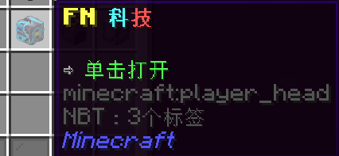
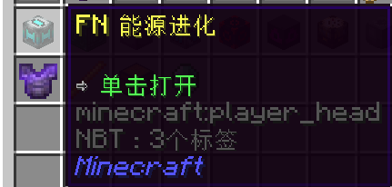
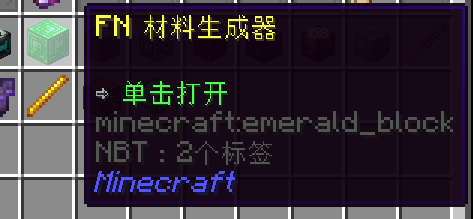
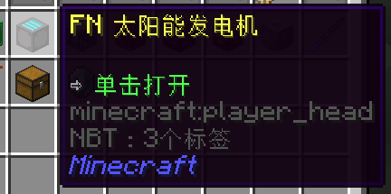
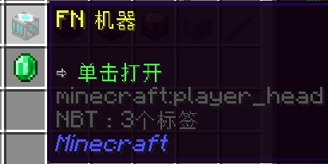
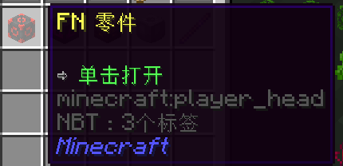
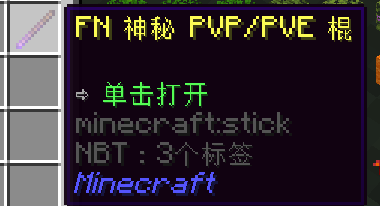
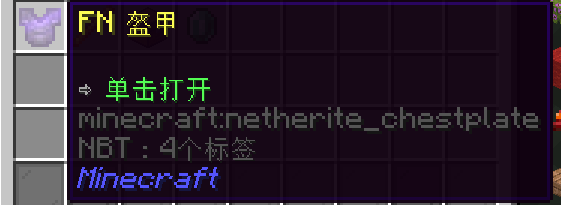
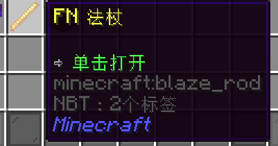
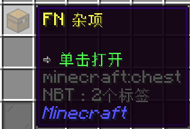

# :part_alternation_mark: FN-Amplifications - FN 科技
一个slimefun插件，为你的服务器增加了不同类型的物品和更多的内容! 从太阳能电池板、机器、破块器、齿轮、法杖和更多!
更多的内容在游戏中等待着玩家自己去尝试和制作。在制作方面，它与InfinityXpansion和LiteXpansion的难度水平相当。
的难度，快来探索FN的放大功能吧! 

这是一个添加了众多种类物品、为服务器带来更多玩法的 Slimefun 附属插件! 从太阳能板, 机器, 方块挖掘机, 装备, 法杖, 还有各式各样的物品!

更多玩法等待着玩家自己在尝试和制作中发现. 附属中物品的合成难度与 InfinityXpansion 和 LiteXpansion 相似, 不过你所付出的努力都是值得的!

该附属支持 1.16.x - 1.19.x 版本

### :computer: 在功率率、缓冲区、容量、滴答率、工作人员最大使用量等方面，一切都是可配置的。
``/plugins/FNAmplifications``文件夹里的大部分东西都是可配置的。
 
每个主要类别都有自己的可配置设置。

## :bulb: 特性
- **能源进化 (PowerXpansion)** - 添加了 12 种等级的有可切换全息文本的发电机, 还能够使用 LiteXpansion 物品作为合成材料的一部分!
- **太阳能板** - 为那些全天高耗能的机器新增了 8 种等级的太阳能板
- **材料生成器** - 粘土、诡异菌岩、泥土, 应有尽有!
- **机器** - 机器降级机, 冷凝机, 压缩机, 回收机和转换器
- **金属废料** - 使用机器降级机降级机器可以获取金属废料, 并用作合成 FN 组件的材料
- **电动方块挖掘机** - 配有可开关精准采集的方块挖掘机!
- **20+ 种法杖** - 有着[区域效果云](https://wiki.biligame.com/mc/%E6%BB%9E%E7%95%99%E8%8D%AF%E6%B0%B4#%E5%8C%BA%E5%9F%9F%E6%95%88%E6%9E%9C%E4%BA%91), 移动实体等更多效果, 记得去试试!
- **11 种神秘魔棍** - 用于 PVP/PVE 的魔棍, 使用时通过消耗你的经验值, 提升你的 PVP 能力!
- **25+ 种宝石** - 将宝石镶嵌在武器或盔甲上获得额外的能力和加成!
- **箭袋** - 可以储存普通箭和光灵箭, 节省背包空间.
- **FN 盔甲** - 升级盔甲获得额外属性和附魔
- **FN 锄头** - 自动耕种 5x5 区域内的农田, 还可以自动补种!
- **FN 方块转向机** - 能够旋转陶瓦、楼梯、门、台阶等有方向的方块!
- **FN 唱片机** - 能够播放放入的唱片, 并且支持顺序播放的唱片机, 有 3 到 12 个槽位可供储存唱片, 不必手动换碟!
- **FN 自动搭梯机** - 自动在上下最大8格高度的方块上放置梯子
- **FN 闪耀珍珠** - 用这颗珍珠带着你骑着的实体一起传送!
- **FN 可投掷的火炬** - 点击右键向目标位置投掷火炬，如果碰到障碍物会自动放置!
- **在未来还有更多!**

## :arrow_down: 下载

### [点击下载汉化版](https://builds.guizhanss.cn/buiawpkgew1/FN-FAL-s-Amplifications-zh/main) 
<p align="center">
  <a href="https://github.com/buiawpkgew1/FN-FAL-s-Amplifications-zh/actions/workflows/maven.yml">
    
  </a>
  <a href="https://builds.guizhanss.cn/buiawpkgew1/FN-FAL-s-Amplifications-zh/main">
    
  </a>
</p>

## :blue_book: 插件在 Slimefun 指南中的样式



#### :battery: 能源扩展



#### :white_square_button: 材料生成器



#### :high_brightness: 太阳能发电机



#### :factory: 机器与物品



#### :sparkler: 魔棍



#### :tshirt: 装备



#### :oden: 法杖



#### :gift: 杂项



### :computer: 几乎全部都是可配置的

大多数在 ```/plugins/FNAmplifications``` 文件下的文件都是可配置的.

每个文件夹都有不同的可配置设置.

如果担心平衡这类的问题, 你可以修改这些设置.

### :running: 反馈

注意: 在非官方汉化版中遇到问题时, 请在交流群反馈

<p>
  <a href="https://discord.gg/slimefun">
    
  </a>
  <a href="https://discord.gg/SqD3gg5SAU">
    
  </a>
</p>

## :label: Credits
基于SMG的发电机的Waleks<br>
这个插件使用了头部纹理，这要归功于minecraft-heads:<br>
https://minecraft-heads.com/
